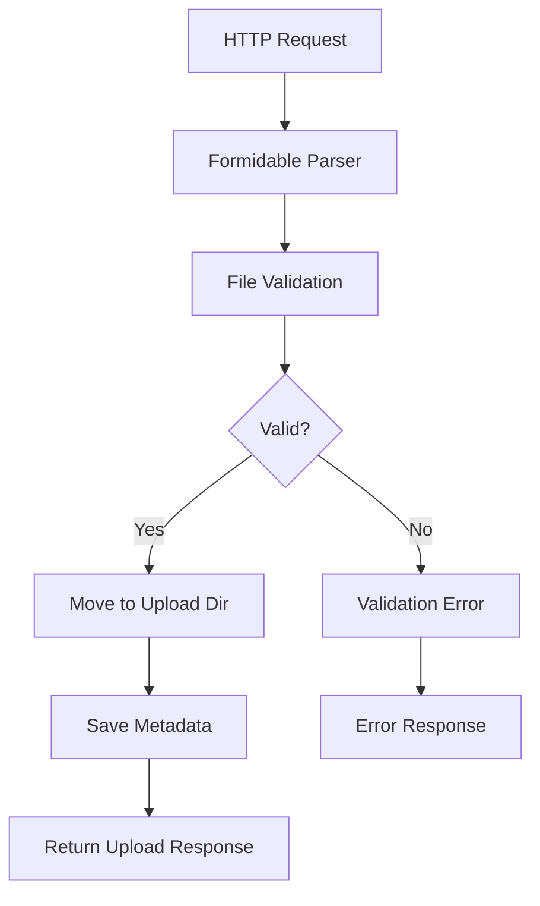
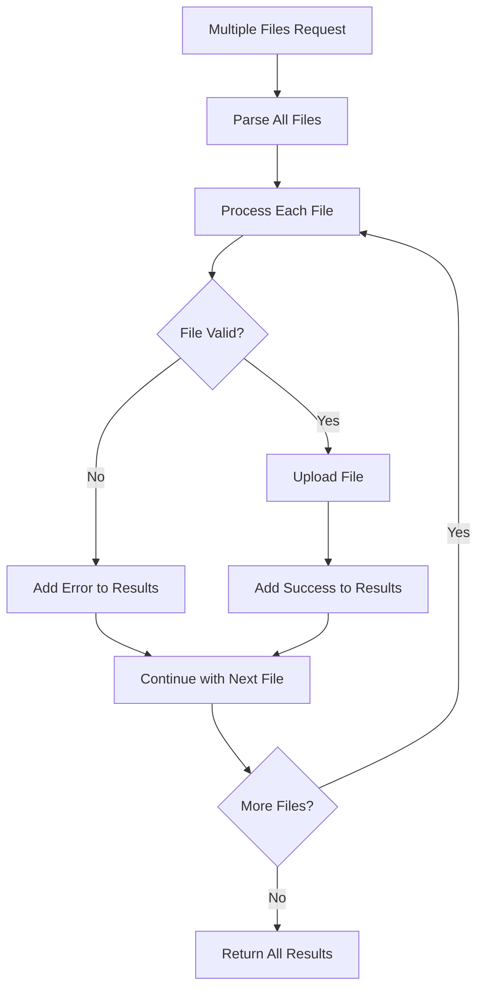

# Formidable File Upload Geçiş Kılavuzu

Bu dokümant, DeepWebAI projesinde Multer'dan Formidable'a geçiş sürecini açıklar.

## Geçiş Özeti

### Önceki Yapı (Multer + Express-style)
- **Framework**: Multer 1.4.5-lts.1
- **Integration**: Express middleware pattern
- **File Handling**: Express Request object
- **Upload Strategy**: Memory/disk storage

### Yeni Yapı (Formidable + Elysia Native)
- **Framework**: Formidable 3.5.1
- **Integration**: Elysia.js native parsing
- **File Handling**: Node.js IncomingMessage
- **Upload Strategy**: Stream-based processing

## Yeni Bağımlılıklar

```json
{
  "formidable": "^3.5.1",
  "@types/formidable": "^3.4.5"
}
```

## Kaldırılan Bağımlılıklar

```json
{
  "multer": "^1.4.5-lts.1",
  "@types/multer": "^1.4.11"
}
```

## Ana Değişiklikler

### 1. File Upload Service

#### Önceki (Multer)
```typescript
import multer from 'multer';

const upload = multer({
  dest: 'uploads/',
  limits: { fileSize: 10 * 1024 * 1024 }
});

app.post('/upload', upload.single('file'), (req, res) => {
  const file = req.file;
  // Process file
});
```

#### Yeni (Formidable)
```typescript
import { IncomingForm } from 'formidable';

export class FormidableFileService {
  async parseForm(req: IncomingMessage): Promise<{ fields: Fields; files: Files }> {
    return new Promise((resolve, reject) => {
      const form = new IncomingForm({
        uploadDir: this.uploadDir,
        keepExtensions: true,
        maxFileSize: MAX_FILE_SIZE,
        filter: this.validateFileType
      });

      form.parse(req, (err, fields, files) => {
        if (err) reject(err);
        else resolve({ fields, files });
      });
    });
  }
}
```

### 2. File Validation

#### Önceki (Multer)
```typescript
const multerConfig = {
  fileFilter: (req, file, cb) => {
    if (ALLOWED_TYPES.includes(file.mimetype)) {
      cb(null, true);
    } else {
      cb(new Error('Invalid file type'), false);
    }
  },
  limits: {
    fileSize: MAX_FILE_SIZE
  }
};
```

#### Yeni (Formidable)
```typescript
const formConfig = {
  filter: ({ name, originalFilename, mimetype }) => {
    if (!originalFilename) return false;
    
    const extension = extname(originalFilename).toLowerCase();
    const isValidExtension = ALLOWED_FILE_EXTENSIONS.includes(extension);
    const isValidMimeType = SUPPORTED_TYPES.includes(mimetype);
    
    return isValidExtension && isValidMimeType;
  },
  maxFileSize: MAX_FILE_SIZE,
  allowEmptyFiles: false,
  minFileSize: 1
};
```

### 3. Multiple File Upload

#### Önceki (Multer)
```typescript
app.post('/upload-multiple', upload.array('files', 10), (req, res) => {
  const files = req.files as Express.Multer.File[];
  files.forEach(file => {
    // Process each file
  });
});
```

#### Yeni (Formidable)
```typescript
async uploadMultipleFiles(files: FormidableFile[], userId?: string): Promise<FileUploadResponse[]> {
  const results: FileUploadResponse[] = [];
  
  for (const file of files) {
    try {
      const result = await this.uploadFile({ file, fields: {} }, userId);
      results.push(result);
    } catch (error) {
      results.push({
        ...fileInfo,
        error: error.message
      });
    }
  }
  
  return results;
}
```

## API Endpoint Değişiklikleri

### File Upload Endpoints

| Endpoint | Önceki | Yeni | Durum |
|----------|--------|------|-------|
| `POST /api/files/upload` | ✅ Multer single | ✅ Formidable single | Aynı API |
| `POST /api/files/upload/multiple` | ✅ Multer array | ✅ Formidable multiple | Aynı API |
| `POST /api/files/:id/process` | ✅ File processing | ✅ File processing | Aynı API |
| `GET /api/files/:id/status` | ✅ Processing status | ✅ Processing status | Aynı API |
| `GET /api/files/:id/download` | ✅ File download | ✅ File download | Aynı API |
| `DELETE /api/files/:id` | ✅ File deletion | ✅ File deletion | Aynı API |

### New Endpoints

| Endpoint | Açıklama |
|----------|----------|
| `POST /api/files/ocr` | OCR işlemi için özel endpoint |
| `GET /api/files/stats` | Upload istatistikleri |
| `GET /api/files/types` | Desteklenen dosya türleri |

## Controller Implementation

### Önceki (Multer Controller)
```typescript
export class FileController {
  async uploadFile(context: Context): Promise<FileUploadResponse> {
    const { body } = context;
    const file = body as any; // Multer processed file
    
    const fileData: FileUploadData = {
      buffer: file.buffer,
      originalName: file.originalname,
      mimeType: file.mimetype,
      size: file.size
    };

    return await fileService.uploadFile(fileData);
  }
}
```

### Yeni (Formidable Controller)
```typescript
export class FormidableFileController {
  async uploadFile(context: Context): Promise<FileUploadResponse> {
    // Convert Elysia request to Node.js IncomingMessage
    const req = this.elysiaToNodeRequest(context);
    
    // Parse multipart form data with Formidable
    const { fields, files } = await formidableFileService.parseForm(req);
    
    const fileEntries = Object.entries(files);
    const [fieldName, file] = fileEntries[0];
    const uploadFile = Array.isArray(file) ? file[0] : file;

    const uploadData: FormidableUploadData = {
      file: uploadFile,
      fields
    };

    return await formidableFileService.uploadFile(uploadData);
  }
}
```

## File Processing Pipeline

### 1. Upload Flow



### 2. Multiple Upload Flow



## Security Enhancements

### File Type Validation

```typescript
// Enhanced file type checking
filter: ({ name, originalFilename, mimetype }) => {
  // Check file extension
  const extension = extname(originalFilename || '').toLowerCase();
  if (!ALLOWED_FILE_EXTENSIONS.includes(extension)) return false;
  
  // Check MIME type
  if (!SUPPORTED_MIME_TYPES.includes(mimetype)) return false;
  
  // Additional security checks
  if (originalFilename && /\.(php|exe|bat|cmd|scr)$/i.test(originalFilename)) {
    return false;
  }
  
  return true;
}
```

### File Size Limits

```typescript
const formConfig = {
  maxFileSize: MAX_FILE_SIZE,        // 50MB per file
  maxFieldsSize: 10 * 1024 * 1024,  // 10MB for fields
  maxFields: 50,                     // Max 50 form fields
  allowEmptyFiles: false,            // Reject empty files
  minFileSize: 1                     // Minimum 1 byte
};
```

### Path Traversal Protection

```typescript
// Safe filename generation
const generateSafeFilename = (originalName: string): string => {
  const fileId = uuidv4();
  const extension = extname(originalName).toLowerCase();
  const sanitizedExt = extension.replace(/[^a-zA-Z0-9.]/g, '');
  return `${fileId}${sanitizedExt}`;
};
```

## Error Handling

### Formidable Error Types

```typescript
interface FormidableError extends Error {
  code?: string;
  httpCode?: number;
}

// Error handling in form parsing
form.parse(req, (err, fields, files) => {
  if (err) {
    if (err.code === 'LIMIT_FILE_SIZE') {
      reject(this.createServiceError('FILE_TOO_LARGE', 'File size exceeds limit'));
    } else if (err.code === 'LIMIT_UNEXPECTED_FILE') {
      reject(this.createServiceError('UNEXPECTED_FILE', 'Unexpected file field'));
    } else {
      reject(this.createServiceError('FORM_PARSE_ERROR', 'Failed to parse form data', err));
    }
  } else {
    resolve({ fields, files });
  }
});
```

## Performance Optimizations

### 1. Stream-based Processing

```typescript
// Formidable streams files to disk instead of loading into memory
const form = new IncomingForm({
  uploadDir: this.uploadDir,
  keepExtensions: true,
  // Files are streamed directly to disk, not loaded into memory
});
```

### 2. Concurrent Multiple Uploads

```typescript
async uploadMultipleFiles(files: FormidableFile[]): Promise<FileUploadResponse[]> {
  // Process files concurrently for better performance
  const uploadPromises = files.map(file => 
    this.uploadFile({ file, fields: {} }).catch(error => ({
      error: error.message,
      originalName: file.originalFilename
    }))
  );
  
  return Promise.all(uploadPromises);
}
```

### 3. File Validation Optimizations

```typescript
// Early validation before processing
const validateFile = (file: FormidableFile): void => {
  // Quick size check
  if (file.size > MAX_FILE_SIZE) {
    throw new Error('File too large');
  }
  
  // Quick extension check
  const extension = extname(file.originalFilename || '').toLowerCase();
  if (!ALLOWED_EXTENSIONS.includes(extension)) {
    throw new Error('Invalid file type');
  }
};
```

## Testing

### Unit Tests

```typescript
describe('Formidable File Service', () => {
  it('should upload file successfully', async () => {
    const mockFile = {
      filepath: '/tmp/upload_123',
      originalFilename: 'test.pdf',
      mimetype: 'application/pdf',
      size: 1024
    };

    const result = await formidableFileService.uploadFile({
      file: mockFile,
      fields: {}
    });

    expect(result.originalName).toBe('test.pdf');
    expect(result.status).toBe('uploaded');
  });
});
```

### Integration Tests

```typescript
describe('File Upload Integration', () => {
  it('should handle multipart form upload', async () => {
    const response = await request(app)
      .post('/api/files/upload')
      .attach('file', 'test.pdf')
      .field('description', 'Test file');

    expect(response.status).toBe(201);
    expect(response.body).toHaveProperty('id');
  });
});
```

## Migration Checklist

### ✅ Tamamlanan İşlemler

- [x] FormidableFileService implementasyonu
- [x] FormidableFileController oluşturuldu
- [x] Router endpoints güncellendi
- [x] File validation geliştirildi
- [x] Multiple file upload support
- [x] Error handling iyileştirildi
- [x] Unit testler oluşturuldu
- [x] Package.json güncellendi

### 🔄 Yapılması Gerekenler

- [ ] Performance testing
- [ ] Load testing with large files
- [ ] Security audit
- [ ] Memory usage optimization
- [ ] Error monitoring setup
- [ ] Production deployment test

## Configuration

### Environment Variables

```env
# File upload configuration
UPLOAD_DIR=/app/uploads
MAX_FILE_SIZE=52428800  # 50MB
ALLOWED_FILE_TYPES=pdf,doc,docx,txt,jpg,png,gif

# Processing configuration
PROCESSING_TIMEOUT=300000  # 5 minutes
MAX_CONCURRENT_UPLOADS=10
```

### Formidable Configuration

```typescript
const formConfig = {
  // Upload directory
  uploadDir: process.env.UPLOAD_DIR || './uploads',
  
  // Keep file extensions
  keepExtensions: true,
  
  // File size limits
  maxFileSize: parseInt(process.env.MAX_FILE_SIZE || '52428800'),
  maxFieldsSize: 10 * 1024 * 1024,
  maxFields: 50,
  
  // Security settings
  allowEmptyFiles: false,
  minFileSize: 1,
  
  // File type filtering
  filter: this.validateFileType,
  
  // Encoding
  encoding: 'utf-8',
  
  // Hash calculation (optional)
  hashAlgorithm: 'sha256'
};
```

## Monitoring ve Logging

### File Upload Metrics

```typescript
// Track upload metrics
const uploadMetrics = {
  totalUploads: 0,
  successfulUploads: 0,
  failedUploads: 0,
  totalBytesUploaded: 0,
  averageUploadTime: 0
};

// Log significant events
logger.info('File upload started', {
  fileId,
  originalName: file.originalFilename,
  size: file.size,
  mimetype: file.mimetype,
  userId
});
```

### Error Monitoring

```typescript
// Monitor common errors
const commonErrors = {
  'FILE_TOO_LARGE': 0,
  'INVALID_FILE_TYPE': 0,
  'UPLOAD_FAILED': 0,
  'PROCESSING_FAILED': 0
};

// Alert on high error rates
if (errorRate > 0.1) {
  logger.error('High file upload error rate detected', {
    errorRate,
    period: '1hour'
  });
}
```

## Troubleshooting

### Common Issues

#### 1. Large File Upload Timeouts
```typescript
// Increase timeouts for large files
const form = new IncomingForm({
  maxFileSize: 100 * 1024 * 1024, // 100MB
  timeout: 5 * 60 * 1000 // 5 minutes
});
```

#### 2. Memory Issues
```typescript
// Use streaming to avoid memory issues
const form = new IncomingForm({
  uploadDir: './uploads', // Stream to disk
  keepExtensions: true,
  // Don't load entire file into memory
});
```

#### 3. File Permission Errors
```typescript
// Ensure upload directory permissions
await fs.mkdir(uploadDir, { 
  recursive: true, 
  mode: 0o755 
});
```

---

**Not**: Bu geçiş, file upload performansını ve güvenliğini artırmak için tasarlanmıştır. API compatibility korunmuştur.
