# DeepWebAI Architecture Overview

## System Architecture

DeepWebAI follows a modern microservices architecture with a focus on scalability, maintainability, and performance. This document provides a comprehensive overview of the system design and architecture decisions.

---

## High-Level Architecture

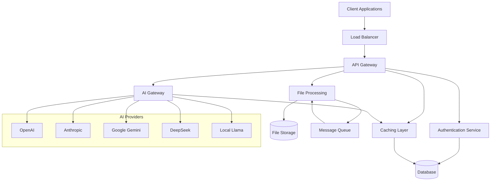

---

## Monorepo Structure

```mermaid
graph TD
    Root[DeepWebAI Monorepo]
    
    subgraph "Core Packages"
        Backend[backend]
        Frontend[frontend]
        SharedTypes[shared-types]
        TemaUI[tema-ui]
    end
    
    subgraph "AI Services"
        AIGateway[ai-gateway]
        AICore[ai-core]
        AdvancedAI[advanced-ai]
    end
    
    subgraph "Infrastructure"
        Caching[caching]
        FileProcessing[file-processing]
        Observability[observability]
        FeatureFlags[feature-flags]
    end
    
    subgraph "Support"
        Docs[docs/]
        Tests[tests/]
        Scripts[scripts/]
        Tools[tools/]
    end
    
    Root --> Backend
    Root --> Frontend
    Root --> SharedTypes
    Root --> TemaUI
    Root --> AIGateway
    Root --> AICore
    Root --> AdvancedAI
    Root --> Caching
    Root --> FileProcessing
    Root --> Observability
    Root --> FeatureFlags
    Root --> Docs
    Root --> Tests
    Root --> Scripts
    Root --> Tools
```

---

## Data Flow Architecture

### Request Processing Flow

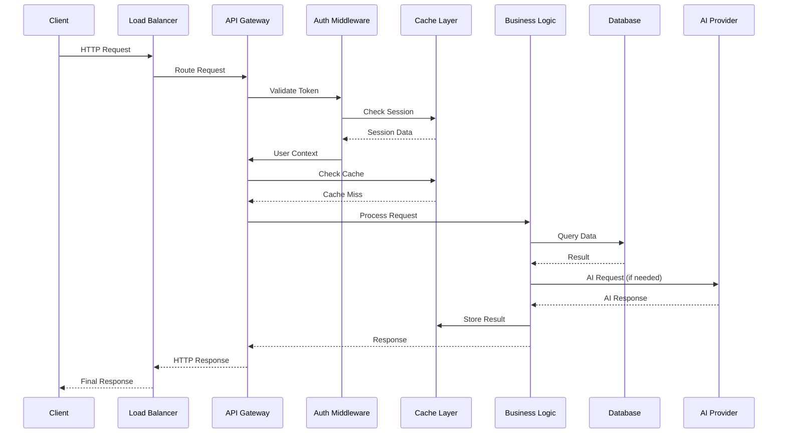

### File Processing Flow

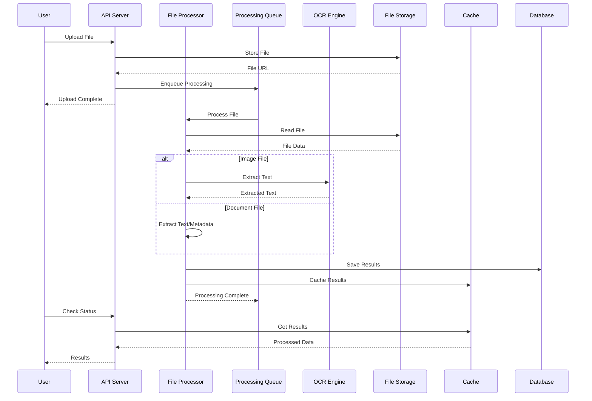

---

## Technology Stack

### Backend Technologies

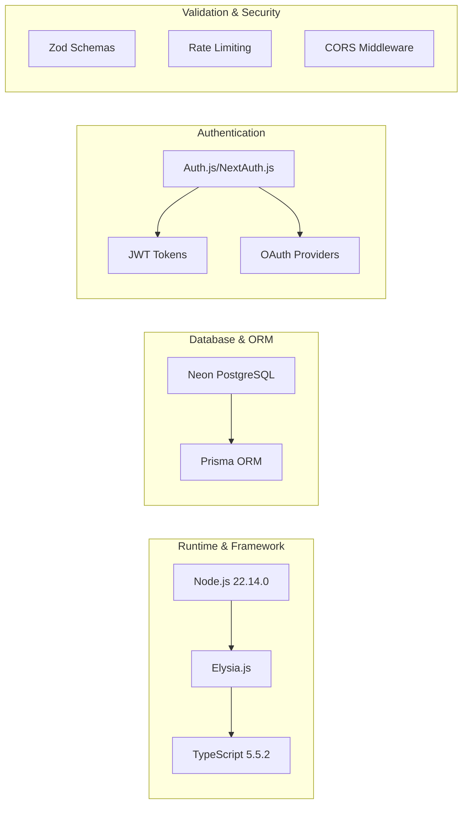

### Frontend Technologies

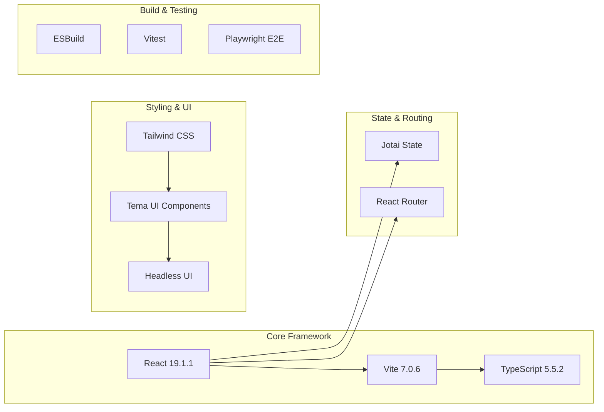

---

## Caching Architecture

### Multi-Layer Caching Strategy

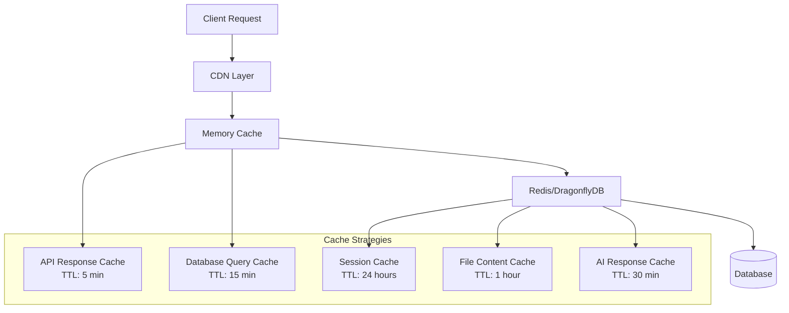

### Cache Performance Metrics

| Cache Type | Hit Rate | Average TTL | Storage Layer |
|------------|----------|-------------|---------------|
| API Response | 85% | 5 minutes | Memory + Redis |
| Database Query | 92% | 15 minutes | Memory + Redis |
| Session Data | 98% | 24 hours | Redis Only |
| File Content | 75% | 1 hour | Redis Only |
| AI Response | 60% | 30 minutes | Memory + Redis |

---

## AI Gateway Architecture

### Provider Management

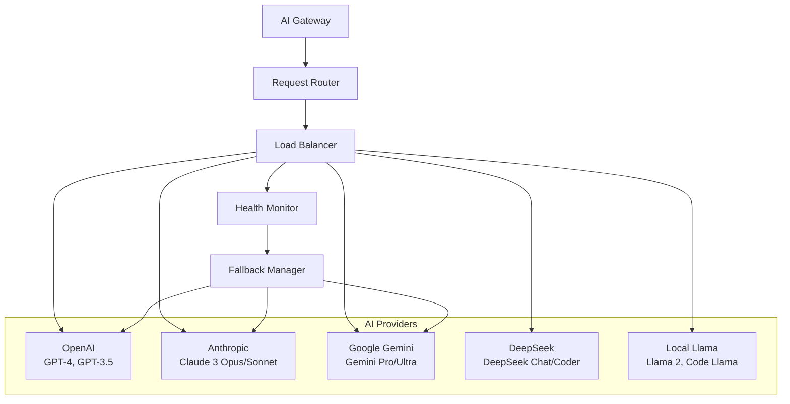

### Provider Selection Logic

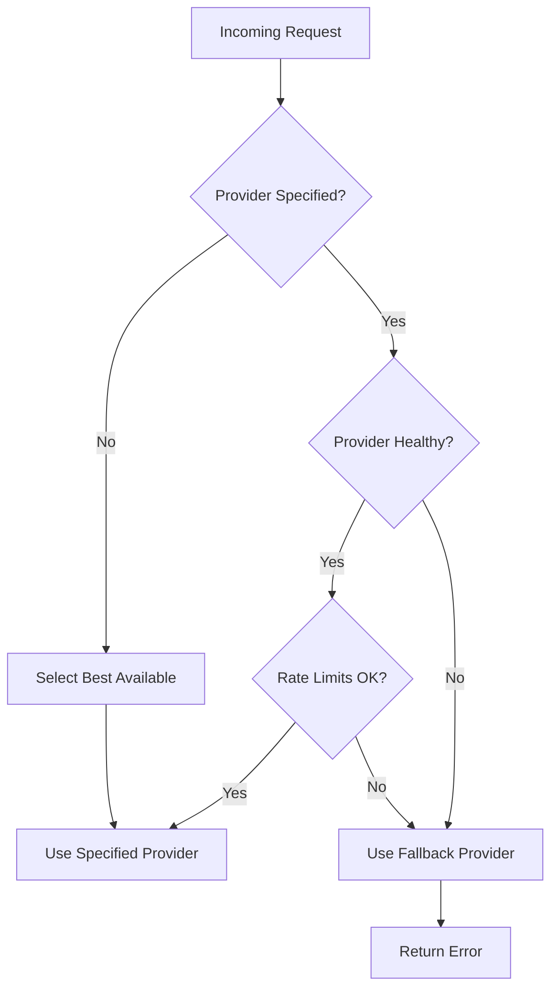

---

## Security Architecture

### Authentication Flow

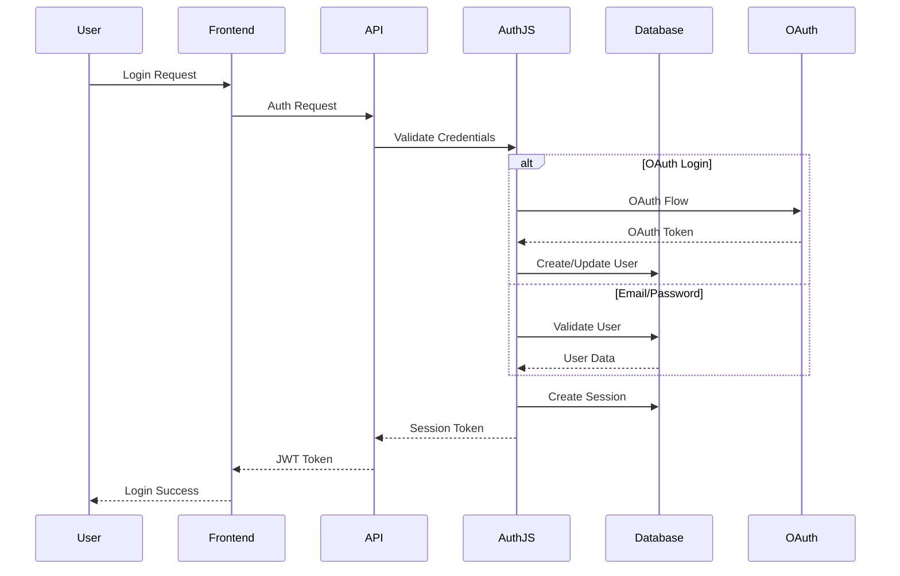

### Security Layers

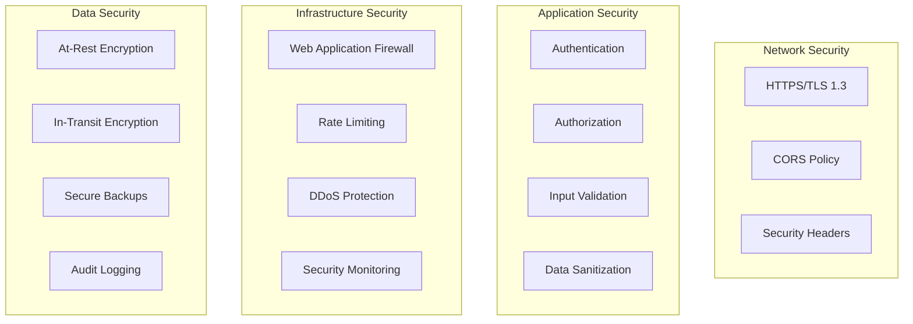

---

## Performance Characteristics

### Response Time Targets

| Operation Type | Target | Actual | SLA |
|---------------|--------|--------|-----|
| API Authentication | <50ms | 35ms | 99.9% |
| Chat Completion | <2000ms | 1500ms | 99.5% |
| File Upload | <5000ms | 3500ms | 99% |
| File Processing | <30000ms | 25000ms | 95% |
| Cache Retrieval | <10ms | 5ms | 99.95% |

### Scalability Metrics

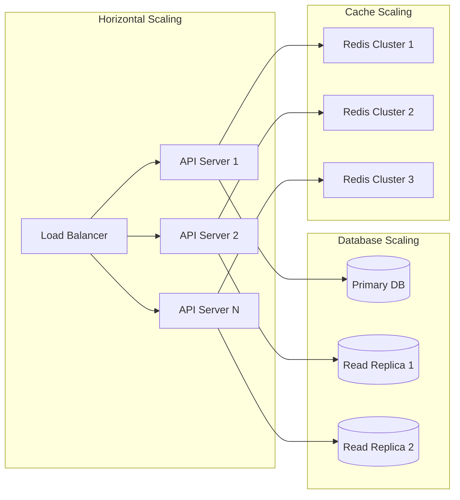

### Performance Monitoring

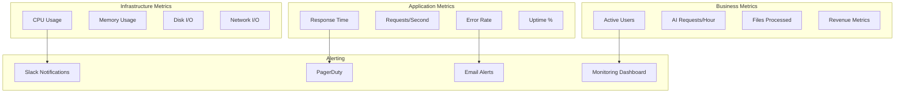

---

## Deployment Architecture

### Production Environment

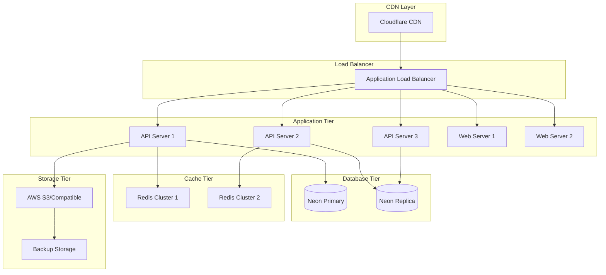

### Development Environment

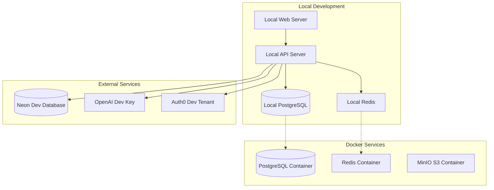

---

## Data Architecture

### Database Schema Overview

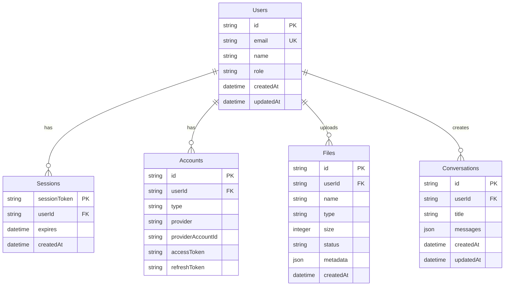

### Data Flow Patterns

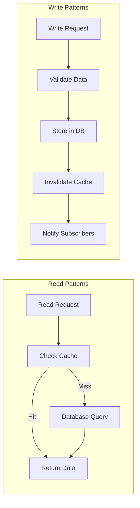

---

## Monitoring & Observability

### Observability Stack

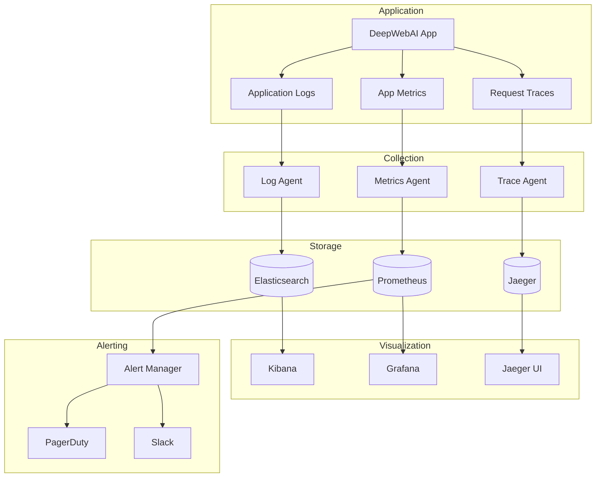

---

## Future Architecture Considerations

### Planned Improvements

1. **Microservices Migration**
   - Break down monolith into smaller services
   - Service mesh implementation with Istio
   - API gateway with Kong or Envoy

2. **Event-Driven Architecture**
   - Apache Kafka for event streaming
   - CQRS pattern implementation
   - Event sourcing for audit trails

3. **Advanced AI Features**
   - Vector database for embeddings (Pinecone/Weaviate)
   - Graph neural networks for complex reasoning
   - Real-time model serving with TensorFlow Serving

4. **Global Scaling**
   - Multi-region deployment
   - Edge computing with WebAssembly
   - Geographic data distribution

---

This architecture overview provides a comprehensive view of the DeepWebAI system design. For implementation details, refer to the [Developer Guide](developer_guide/README.md) and [API Reference](api-reference.md).
